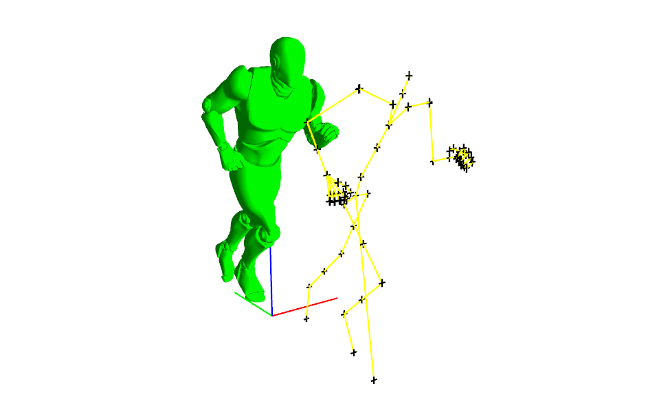

# OpenGL Skeletal Animation

# Context
ISART Digital school project made in 5 days, this project has been an introduction to Animation Programming, the objective was to learn how implement Skeletal Animation in a Game Engine context.

# Features
- 3D Animation computing
- Blending Animations
- Hardware Skinning

# Requirements
- OS: Windows 7
- GPU: Graphics card supporting Modern OpenGL

# Software
- Visual Studio 2017

# Dependencies
- WhiteBoxEngine Debug x86 (3D Engine made by a professor at ISART Digital: https://github.com/Trizek/WhiteBoxEngine)
  - WhiteBoxEngine compatibility -> 32 bits platform exclusively
  - GLEW (Graphics API)
  - SDL (Windowing)
- AltMath (Mathematic Library made in collaboration with my classmates (Uploaded soon on GitHub))
- Windows (Inputs)

# Platforms
- Windows

# Undefined behavior
The version of WhiteBoxEngine used for this project is facing issue with the resources parsing that result in the not loading of the 3D Model.
If this issue is occuring you have to close the application and re-open it again.

# Next Updates
- Configure the project with WhiteBoxEngine Release x86 (Only Debug 32 bits platform is configured for now)
- Clean the architecture of the project

